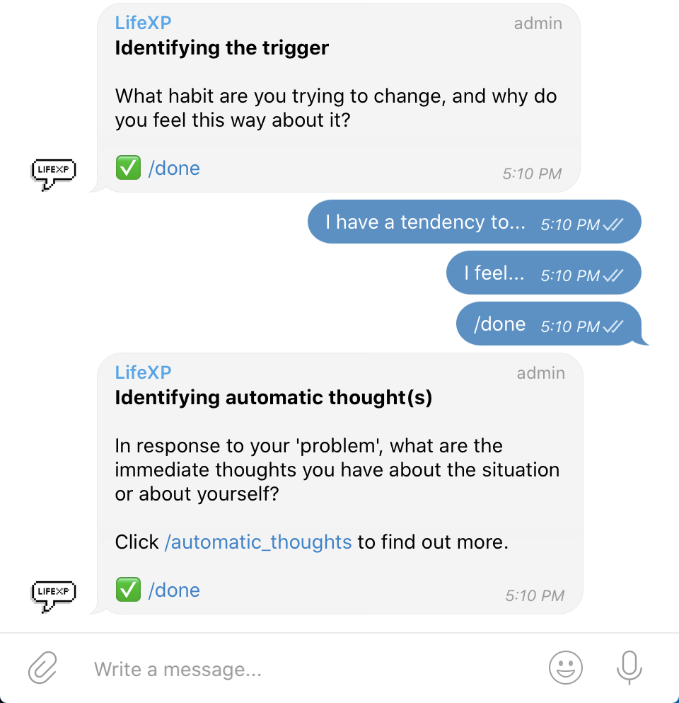
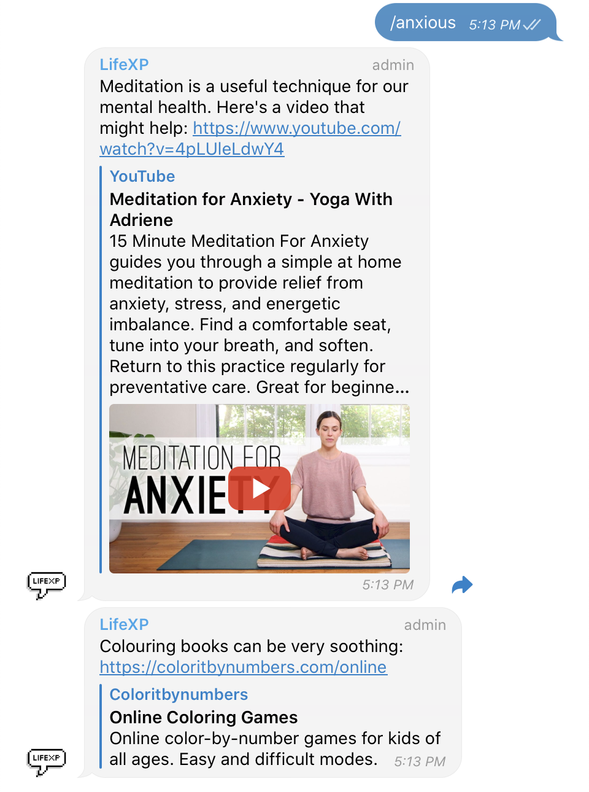
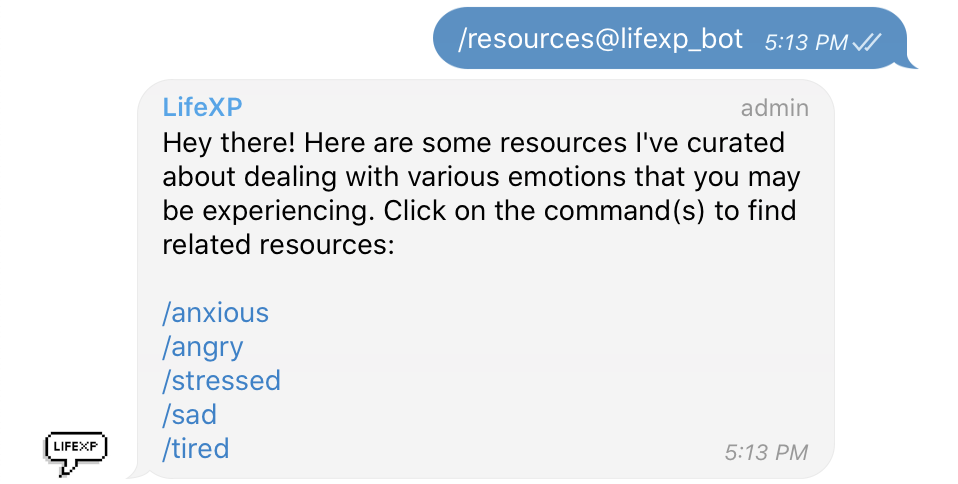

# LifeXP: Gamified Journalling Chatbot

LifeXP combines gamification and journalling into a chatbot. It aims to provide a safe, fun and convenient way for you to pen down your thoughts and even organise them for browsing later. At the end of your journalling sessions, you are rewarded with experience points to reward you for your effort.

## Problem Statement

> Create a tool that will address specific or multiple mental health issues in your community, whether you want to design and develop an app, create a data visualisation or anything else you can think of!

Given that journalling about our emotions is important but can be difficult, how might we develop a solution that makes journalling convenient, frictionless and fun?

## Using the Bot

LifeXP has been deployed to Heroku for public use. You may access the bot at the username [@lifexp_bot](https://t.me/lifexp_bot). If the bot does not respond immediately, please be patient as it may have fallen asleep 😴

## Hackathon Features

**Click [here](https://github.com/xlzior/lifexp-bot/pull/11) to view the hackathon pull request for features developed during the hackathon.**

### Cognitive Behavioural Therapy

Cognitive Behavioural Therapy (CBT) helps you deal with automatic, emotion-filled thoughts and negative thinking patterns. Ordinarily, CBT is conducted with a counsellor in 1 hour sessions on a weekly or bi-weekly basis, for 5-6 months. While you should still seek help from a mental health professional if you need to, LifeXP can help you practice the techniques of CBT on your own, in a structured manner.

To begin a structured CBT journalling session with LifeXP, send the command `/cbt`. The bot will give a brief overview of what CBT is as well as some extra resources. Then, the bot will prompt you with questions to help you unpack your behaviours, thoughts and feelings, one step at a time.

### Recommended Resources

Feeling angry, or anxious? The bot can suggest some resources that might help, or activities for you to try.

To view the full list of resource categories, use the command `/resources`.

## Technical Details

The tech stack that was used is summarised as follows:

      

The bot was created before the MindfulHacks hackathon. During the hackathon, our team designed and developed two new features (CBT journalling and recommended resources). These features build upon the *core* idea of LifeXP as a gamified journalling chatbot, but are **largely independent** of previous features.

**Click [here](https://github.com/xlzior/lifexp-bot/pull/11) to view the hackathon pull request for features developed during the hackathon.**

## Building and Installing

It is highly unlikely that you will need to build, install and run the Telegram bot directly yourself, as the bot has already been deployed for public use. However, here are some overall instructions in the event that you need to do so.

1. Clone the repository.
2. Create a Telegram bot and set up the environment variables as instructed [here](https://github.com/odditive/heroku-node-telegram-bot).

## Acknowledgements

- Telegram Bot API for NodeJS: [node-telegram-bot-api](https://github.com/yagop/node-telegram-bot-api)
- Starter pack for running telegram bot on the Heroku using Node.js: [heroku-node-telegram-bot](https://github.com/odditive/heroku-node-telegram-bot)
