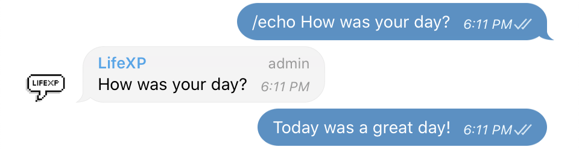
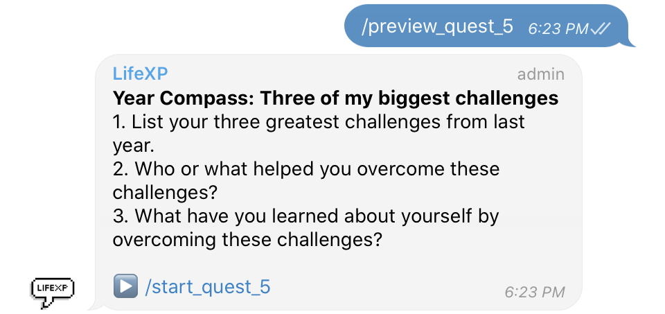
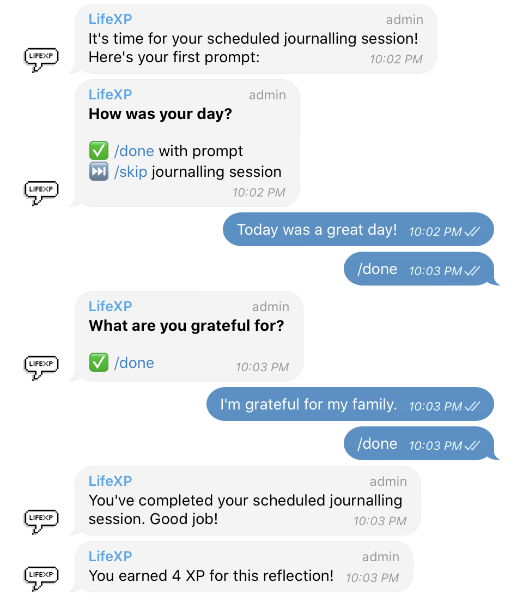

# LifeXP Demo<!-- omit in toc -->

LifeXP combines gamification and journalling into a chatbot. It aims to provide a safe, fun and convenient way for you to pen down your thoughts and even organise them for browsing later.

## Table of Contents<!-- omit in toc -->

- [📝 Journal](#-journal)
- [📖 Browse](#-browse)
- [🎮 Game Features](#-game-features)
- [⚔️ Quests](#️-quests)
- [⏰ Scheduled Journalling Sessions](#-scheduled-journalling-sessions)
- [🛌 Bedtime](#-bedtime)

## 📝 Journal

**`/open`**: Open up LifeXP on Telegram. Take a deep breath. Time to start journalling.

**`/prompt`**: Not sure what to journal about? LifeXP can provide you with a random prompt.

**`/echo`**: If you have a question in mind that you want to explore further, LifeXP can echo the question for you, to help visually break up the entry into sections.

**Emojis**: Let all those emotions out however you wish — including emojis. LifeXP will use your emojis to gauge how you’re feeling.

**Hashtags**: You may use hashtags at any point during your entry. Possible hashtags include emotions, areas of your life, or challenges you’re facing. They’ll come in handy later!

**`/ididathing`**: Even the little things in life should be celebrated. LifeXP helps you celebrate your achievements, big or small. Answer a series of simple questions about your achievement, and be rewarded with XP for it!

**`/close`**: When your reflection has reached a natural close, it’s time to wrap up the conversation and give it a name for future reference.

## 📖 Browse

**`/reflections`**: Browse reflections in reverse chronological order.

**`/hashtags`**: Browse all hashtags used in descending order of frequency.

**`/hashtag`**: Browse reflections by hashtag.

**`/goto`**: When browsing past reflections using any of the above methods, you may revisit old journal entries by clicking on the `/goto` command associated with that entry, which will direct you to the first message of the journal entry.

## 🎮 Game Features

Earn XP through journalling, `/ididathing` or waking up on time. Make full use of LifeXP's features to earn all achievement badges!

**`/lifexp`**: This command creates a pinned message in the chat which acts as a status bar. As you earn XP, the status bar will be updated with your current XP and level. Keep up a journalling streak -- journal consistently every day to maintain your streak count.

**Achievement Badges**: The achievement badges you’ve earned can be viewed under the chat’s “shared media”. Use `/achievements` to list out all your achievement badges again in sorted order.

**`/stats`**: View statistics about your journal entries with LifeXP.

## ⚔️ Quests

LifeXP quests provide you with a series of question prompts around a theme. They provide a more structured journalling session.

 

 

 

 

## ⏰ Scheduled Journalling Sessions

LifeXP can send you a fixed set of prompts every day at a time of your choosing.

Use `/manage_schedules` to get started.

At your selected time, the bot will automatically start the conversation to prompt you to journal.

## 🛌 Bedtime

Struggling to keep up a consistent sleep schedule? Use `/set_bedtime` to set goals for going to sleep and waking up on time.

Send `/good_morning` when you wake up and `/good_night` when you go to bed to be rewarded with XP for sticking to your goals.

